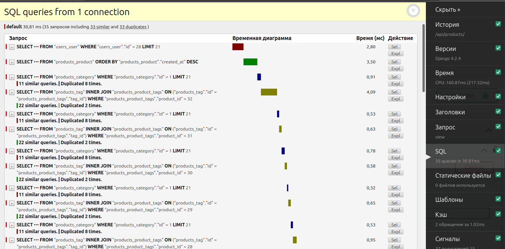
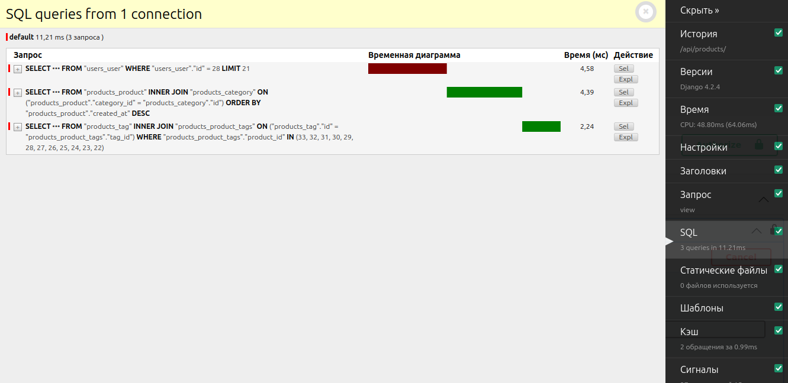

## Тестовое задание для Strong Junior Django-разработчика

### Задание: Разработка REST API для онлайн-магазина

Тестовое задание состоит из регистрации, авторизации и аутентификации (JWT) пользователей. Основной упор делается
оптимизацию запросов к базе данных и обеспечение безопасности.

#### Модели:

Создайте следующие модели для приложения:

1. Модель `Category`
    - Название категории (`name`) - строка, максимальная длина 100 символов.

2. Модель `Tag`
    - Название тэгов (`name`) - строка, максимальная длина 100 символов.

3. Модель `Product`:
    - Многое к одному (`category_id`)
    - Многое ко многим (`tags`)
    - Название товара (`name`) - строка, максимальная длина 100 символов.
    - Описание (`description`) - текстовое поле.
    - Цена (`price`) - десятичное число.
    - Дата добавления (`created_at`) - дата и время создания товара.

4. Модель `User`:
    - Имя пользователя (`username`) - строка, уникальное поле.
    - Электронная почта (`email`) - строка, уникальное поле.
    - Пароль (`password`) - хэш пароля.

#### Задачи:

1. Создайте Django проект с именем "TestShop".

2. Создайте приложения "products" и "users" и настройте их в проекте.

3. Реализуйте следующие API эндпойнты:

   a. Регистрация пользователя:
    - Метод: POST
    - URL: `/api/register/`
    - Параметры: `username`, `email`, `password`
    - Возвращаемый формат данных: JSON
    - Пример запроса:
      ```json
      {
          "username": "user123",
          "email": "user@example.com",
          "password": "securepassword"
      }
      ```
    - Пример ответа:
      ```json
      {
          "message": "User registered successfully."
      }
      ```

   b. Авторизация пользователя:
    - Метод: POST
    - URL: `/api/login/`
    - Параметры: `username`, `password`
    - Возвращаемый формат данных: JSON
    - Пример запроса:
      ```json
      {
          "username": "user123",
          "password": "securepassword"
      }
      ```
    - Пример ответа:
      ```json
      {
          "token": "your_token_here"
      }
      ```

c. Получение списка товаров (требуется аутентификация):

- Метод: GET
- URL: `/api/products/`
- Возвращаемый формат данных: JSON
- Пример ответа:

```json
[
  {
    "id": 1,
    "name": "Example Product 1",
    "description": "This is the first example product.",
    "category_name": "Sport",
    "price": 19.99,
    "created_at": "2023-08-08T12:00:00Z",
    "tags": [
      "example",
      "yes",
      "no"
    ]
  },
  {
    "id": 2,
    "name": "Example Product 2",
    "description": "This is the second example product.",
    "price": 29.99,
    "created_at": "2023-08-08T13:00:00Z",
    "category_name": "Example",
    "tags": []
  },
  ...
]
```

d. Получение excel файла в котором хранится весь список товаров (требуется аутентификация):

- Метод: GET
- URL: `/api/products/export/`
- Возвращаемый формат данных: XLSX

5. Оптимизируйте запросы к базе данных, чтобы минимизировать количество запросов при получении списка товаров.

6. Создайте механизм кеширования для списка товаров с использованием Redis.

7. Разработайте механизм инвалидации кеша при обновлении или создании новых товаров.

8. Создайте Docker-контейнер для вашего приложения.

9. Создайте файл `docker-compose.yml`, который объединяет ваше приложение с базой данных и Redis.

10. Подготовьте отчет, включающий информацию о проведенной оптимизации, использовании асинхронности, эффективности
    кеширования, обертывании в Docker и изменении производительности.

--- 

### Запуск и установка

#### Необходимые инструменты

- [Python 3.10+](https://www.python.org/)
- [Docker](https://www.docker.com/)

#### Установка

1. Клонируйте репозиторий и перейдите в рабочую директорию

```bash
git clone https://github.com/joerude/retmind-test-assignment
cd retmind-test-assignment
```

2. Создайте файл `.env` на основе примера из файла `env-example` и замените заполнители на реальные значения.
   Этот файл содержит конфигурационные параметры для вашего проекта.


3. Запустите docker-compose:

```bash
docker-compose up --build
```

### Отчёт

#### Механизм кеширования

Для минимизации запросов к базе данных и оптимизации производительности при
получении списка товаров, был реализован механизм кеширования с использованием **Redis**. При первом запросе к списку
товаров, данные загружаются из базы данных и сохраняются в кеше. При последующих запросах, данные извлекаются
непосредственно из кеша, что существенно сокращает время запросов и нагрузку на базу данных.

#### Инвалидация кеша

Для обеспечения актуальности данных в кеше, был реализован механизм инвалидации кеша при создании новых товаров или их
обновлении. При добавлении или изменении товара, кеш автоматически инвалидируется, что обеспечивает корректное
обновление данных в следующем запросе списка товаров.

#### Docker / Docker Compose

Для облегчения развертывания и интеграции приложения с **базой данных (Postgres)** и **Redis** был
подготовлен файл [docker-compose.yml](docker-compose.yml).
Этот файл позволяет легко создать и запустить контейнеры для каждой компоненты, обеспечивая совместное функционирование
всех необходимых сервисов.

#### Оптимизация запросов

Для обеспечения эффективной работы и минимизации количества запросов к базе данных, в процессе выполнения задания была
выполнена оптимизация запросов. Для этого были применены методы `select_related` и `prefetch_related`, которые позволяют
заранее выбирать и загружать связанные объекты и поля, тем самым избегая
проблемы [N+1 queries]((https://scoutapm.com/blog/django-and-the-n1-queries-problem)).

До оптимизации, каждый объект товара требовал отдельного запроса к базе данных для
получения информации о категории и тегах. Однако, с использованием select_related('category').prefetch_related('tags'),
была устранена необходимость в дополнительных запросах, что значительно снизило нагрузку на базу данных и ускорило
выполнение запросов.



После оптимизации, видно, что количество запросов сократилось, что привело к повышению
производительности и снижению
времени выполнения.


#### Документация API

OpenAPI (Swagger) по API доступен по адресу:
http://0.0.0.0:8000/api/schema/swagger-ui/#

**Важно**

Для доступа к API, требующим аутентификации, необходимо в заголовке запроса
передавать токен (access-token) в формате: Authorization: Bearer `<token>`.
